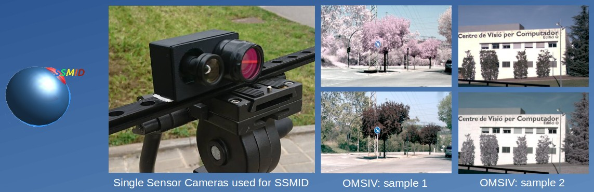

# Single Sensor Multispectral Images Dataset (SSMID)

<div align='center'>

</div>

## Description
<div align='justify'>
The SSMID is a set of three visible and near infrared datasets captured with two single sensor cameras (SSC).
The information acquired by such cameras was saved as RAW images. Images from the cameras are 
correctly registered as indicated <a href="http://www.cvc.uab.es/~asappa/publications/C__IEEE_IPTA_2017.pdf">in the paper</a>. 
Attempting to save as much as possible the whole of multispectral bands information, 
the SSMID datasets are packaged in a Matlab .mat file.
    </div>

### 1.- [OLD] Outdoor Multispectral Images with Vegetation (OMSIV)
This dataset contains 533 nonregistered  Multispectral Images (MSI) with its respective ground truth for 
evaluation training stage). OMSIV.mat is a struct Matlab variable, it is organized as follow:
    
    rgb         | rgbn     |   name     |   rgb_imgs    |   rgbI_imgs   |   nir_imgs     
    ------------|----------|------------|---------------|---------------|------------
    256x256x3   |256x256x4 |images name |256x256x3 uint8|256x256x4 uint8|   256x256
    ---------------------------------------------------------------------------------
    There are 533 rows. The data type of each columns is double if it is not specified

```diff
- Last OMSIV update
```
#### New OMSIV but with the same data

<div align='justify'>
The former OMSIV version had 533 pair of images (visible and multispectral). The new actualization have  532 raw images, of that only 500 have remained after the "Registration" process. Therefore, if you are going to use the updated OMSIV <a href="https://drive.google.com/file/d/1KDi-JJLgMeM6iVN6WXbsAxSzL-_6lIJv/view?usp=sharing">(Download OMSIV)</a> just 500 images will be found.
The omsiv.tar uncompressed file has 4 folders [h5, raw, registered, restorations]. In the h5 folder you will find the images data in .h5, on the other hand, the raw folder has the same images as h5 but in .raw extension. The registered folder has 500 RGB and 500 respective RGB-NIR images. Those images are grouped in train and test folders. The train folder contains 400 images for the color correction using Deep Learning (DL) described in this <a href="https://github.com/xavysp/color_restorer">repo</a>. The remainder images are saved in the test folder for the  DL model testing. (**check below for more details**)
    </div>

***omsiv folder details***

    omsiv
    '-> h5                                  [RGB size=(360,640,3), RGBN size=(360,640,4)]
        '-> rgb (532 RGB raw images)
        '-> rgbn (532 RGB-NIR raw images)
    '-> raw                                 [RGB size=(720,1280), RGBN size=(720,1280)]
        '-> rgb (532 RGB raw images)
        '-> rgbn (532 RGB-NIR raw images)
    '-> registered                          [RGB size=(320,580,3), RGBN size=(320,580,4)]
        '-> rgbr (500 registered RGB raw images)
        '-> rgbnc (500 cutted RGB-NIR raw images)
    '-> restorations                        [RGB size=(320,580,3), RGBN size=(320,580,4)]
        '-> train
            '-> X (400 RGB-NIR corrupted images)
            '-> Y (400 RGB target images)
            '-> train_list.txt  (path list of 400 images :: X/RGBNC_001.h5 Y/RGBR_001.h5...)
        '-> test
            '-> X (100 RGB-NIR corrupted images)
            '-> Y (100 RGB target images)
            '-> Yhat (100 ~RGB images predicted by color_restorer:https://github.com/xavysp/color_restorer)
            '-> test_list.txt  (path list of 100 images)
                '-> X/RGBNC_001.h5 Y/RGBR_001.h5
                '-> .
                '-> .. till 100
                
    omsiv4colorization
    '->train
        '-> X (400 RGB-NIR corrupted images)
        '-> Y (400 RGB target images)
    '-> test
        '-> X (100 RGB-NIR corrupted images)
        '-> Y (100 RGB target images)
    '-> train_list.lst  (path list of 400 images :: train/X/RGBR_001.jpg train/Y/NIR_001.png...)
    '-> test_list.lst  (path list of 100 images :: test/X/RGBR_002.jpg test/Y/NIR_002.png...)
        

### 2.- Outdoor Multispectral Images with no Vegetation (OMSINV)

OMSINV.mat is a Matlab struct  variable. It has 61 multispectral images  with its respective RGB ground truth images. This
variable is composed as follow:

    rgb         | rgbn     |   name     |   rgb_imgs    |   rgbI_imgs   |   nir_imgs     
    ------------|----------|------------|---------------|---------------|------------
    256x256x3   |256x256x4 |images name |256x256x3 uint8|256x256x4 uint8|   256x256
    ---------------------------------------------------------------------------------
    Thera are 61 rows. The data type of each columns is double if it is not specified
 
### 3.- One Scene Outdoor Multispectral Images (SSOMSI)
 The SSOMSI.mat matlab struct variable contains 150 MSI. It is composed by RGB with NIR influence and its respective  RGB ground truth images.
 The variable is organized as follow:
 
    rgb         | rgbn     |   name     |   rgb_imgs    |   rgbI_imgs   |   nir_imgs     
    ------------|----------|------------|---------------|---------------|------------
    256x256x3   |256x256x4 |images name |256x256x3 uint8|256x256x4 uint8|   256x256
    ---------------------------------------------------------------------------------
    Thera are 150 rows. The data type of each columns is double if it is not specified
 
 
## Download
 
 The entirely dataset (SSMID) can be downloaded from:
  [Click here to download](https://www.dropbox.com/s/qoh92yhrsb47pb8/SSMID.zip)
 
 Its  parts can be downloaded individually bellow:
 
<!-- OMSIV (in private mode yet)-->
[OMSIV (updated)](https://drive.google.com/file/d/1KDi-JJLgMeM6iVN6WXbsAxSzL-_6lIJv/view?usp=sharing)

[OMSIV (old)](https://drive.google.com/open?id=0B0givAGTBMIwUDJYejhsUFV0RVU)

<!--OMSINV (in private mode yet) -->
 [OMSINV](https://drive.google.com/open?id=0B0givAGTBMIwZzJrMm5YcXpWTzA)

[SSOMSI](https://drive.google.com/open?id=0B0givAGTBMIwNmxOb1BlVTVTdTg)

 
 

## Reference
We would appreciate if you cite our work when using the dataset:

    @INPROCEEDINGS{soria2017rgb-nirDataset,
    author={X. Soria and A. D. Sappa and A. Akbarinia},
    booktitle={2017 Seventh International Conference on Image Processing Theory, Tools and Applications (IPTA)},
    title={Multispectral single-sensor RGB-NIR imaging: New challenges and opportunities},
    year={2017},
    pages={1-6},
    keywords={Artificial neural networks;Cameras;Image color analysis;Image restoration;Sensitivity;Vegetation mapping;Color restoration;Multispectral images;Neural networks;RGB-NIR dataset;Single-sensor cameras},
    doi={10.1109/IPTA.2017.8310105},
    ISSN={2154-512X },
    month={Nov},
    organization={IEEE}}
    
  
## Contact
For any question please [Click here](https://xavysp.github.io/#contact) to contact us.
 
To open a RAW image you can find helps on [this repository](https://github.com/xavysp/rawImage_extractor) "as well as for dataset visualization".


<!-- Start of Simple-Counter Code -->
<a href="http://www.simple-counter.com/" target="_blank"></a>
<!-- End of Simple-Counter Code -->
